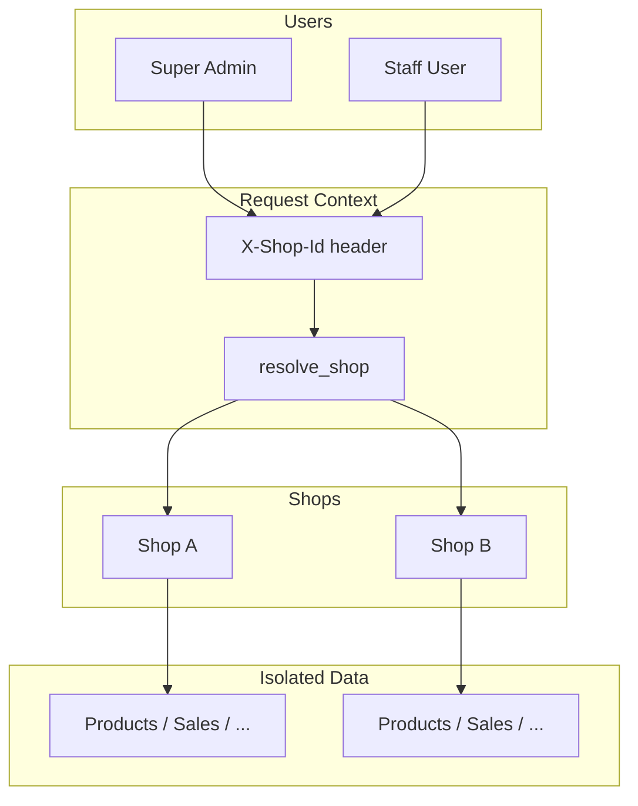

# Multi-Shop (Tenant Isolation)

Popy POS supports **multiple shops** under one deployment. Each shop has its own isolated catalog, inventory, sales, customers, suppliers, purchases, returns, and notification settings. Data from one shop never appears in another.

## Concepts

| Term | Meaning |
|------|---------|
| **Shop** | A retail location or business unit (e.g. "Main Shop", "Branch 02") |
| **Shop context** | The active shop for the current API request |
| **Tenant data** | Records scoped to a single shop via `shop_id` foreign key |

## Data model

Every business entity carries a `shop` foreign key:

- Categories, products
- Customers, suppliers
- Sales, purchases, returns
- Notification settings (one row per shop)
- Staff users (optional `shop` assignment)

Child records (sale items, purchase items, stock transactions) inherit isolation through their parent product or document.

Unique constraints are **per shop** — for example, SKU `COF-001` can exist in Shop A and Shop B independently.

## API behaviour

### Shop header

All business endpoints (except auth) require the active shop via the **`X-Shop-Id`** HTTP header.

```
X-Shop-Id: 1
```

If the header is missing and the user belongs to a shop, the backend falls back to `user.shop_id`.

### Access rules

| Role | Shop access |
|------|-------------|
| **Super Admin** | Any active shop (switch via `X-Shop-Id`) |
| **Manager / Cashier / Inventory Officer** | Only their assigned `shop_id` |

Attempting to access another shop's data returns **403 Forbidden**.

### Auth response

Login and token refresh include shop context:

```json
{
  "user": {
    "shopId": 1,
    "defaultShopId": 1,
    "shops": [
      { "id": 1, "name": "Main Shop", "code": "MAIN" }
    ]
  }
}
```

- **`shops`** — list of shops the user may access
- **`defaultShopId`** — shop selected on login
- **`shopId`** — user's assigned shop (staff); null for super admins without assignment

## Frontend

The React app stores `currentShopId` in local storage and sends it on every API call through the axios interceptor.

**Shop switcher** (top bar):

- Super admins with multiple shops see a dropdown
- Staff with one shop see a read-only label
- Switching shops clears the RTK Query cache so stale data is not shown

## Shops API

| Method | Endpoint | Permission | Description |
|--------|----------|------------|-------------|
| GET | `/api/shops/accessible` | Authenticated | Shops the current user can access |
| GET/POST | `/api/shops/` | `SHOP_MANAGE` | List / create shops |
| GET/PATCH/DELETE | `/api/shops/{id}/` | `SHOP_MANAGE` | Manage a shop |

Only **Super Admin** has `SHOP_MANAGE` (via wildcard permissions).

## Notifications

Notification toggles and manager alert phones are **per shop**. Managers with `SETTINGS_MANAGE` can update notification settings for their shop from the dashboard **Settings** page. Low-inventory emails go to managers assigned to that shop.

## Setup & migration

### Fresh install

```bash
cd popy-be
python manage.py migrate
python manage.py seed_pos
```

`seed_pos` creates a default shop (`MAIN`) and scopes all sample data to it.

### Existing database

Migrations `0002_multishop` (per app) add `shop_id`, create a default **Main Shop**, and backfill existing rows. Optional:

```bash
python manage.py backfill_shops
```

## Isolation checklist

When adding new models or endpoints:

1. Add `shop` FK to tenant models
2. Use `ShopScopedMixin` on viewsets
3. Scope querysets with `filter(shop=self.shop)`
4. Set `shop` on `perform_create`
5. Include shop in unique constraints and reference generation
6. Ensure the frontend sends `X-Shop-Id`

## Diagram


